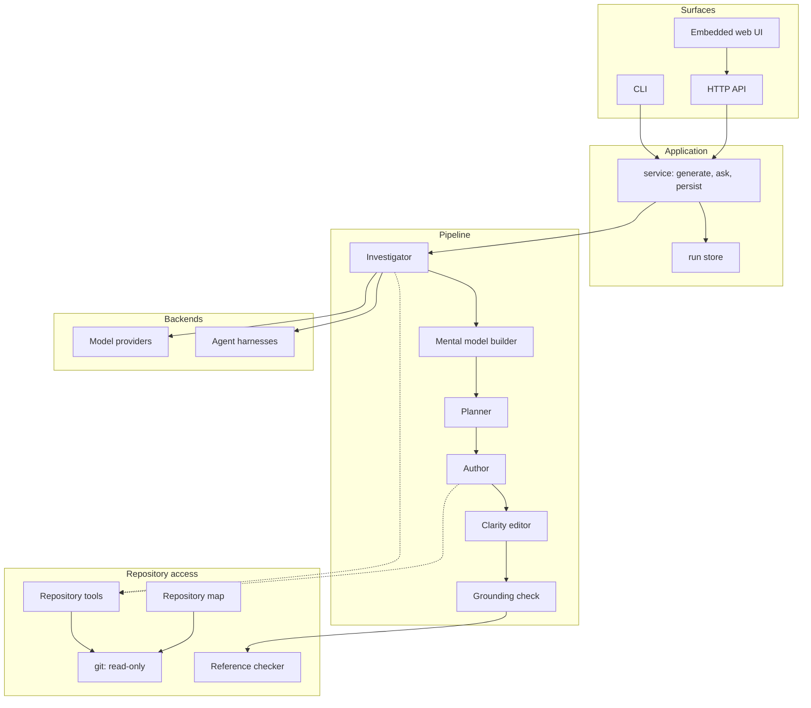
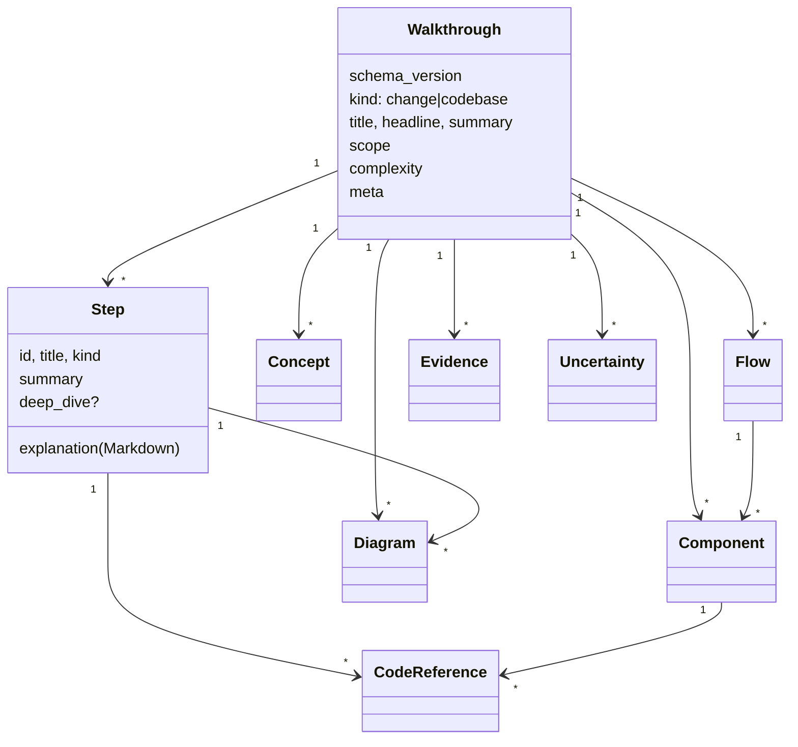
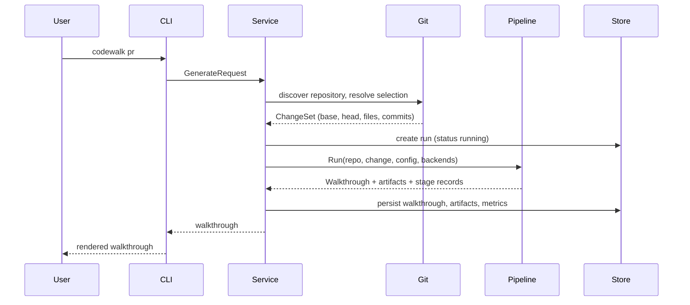
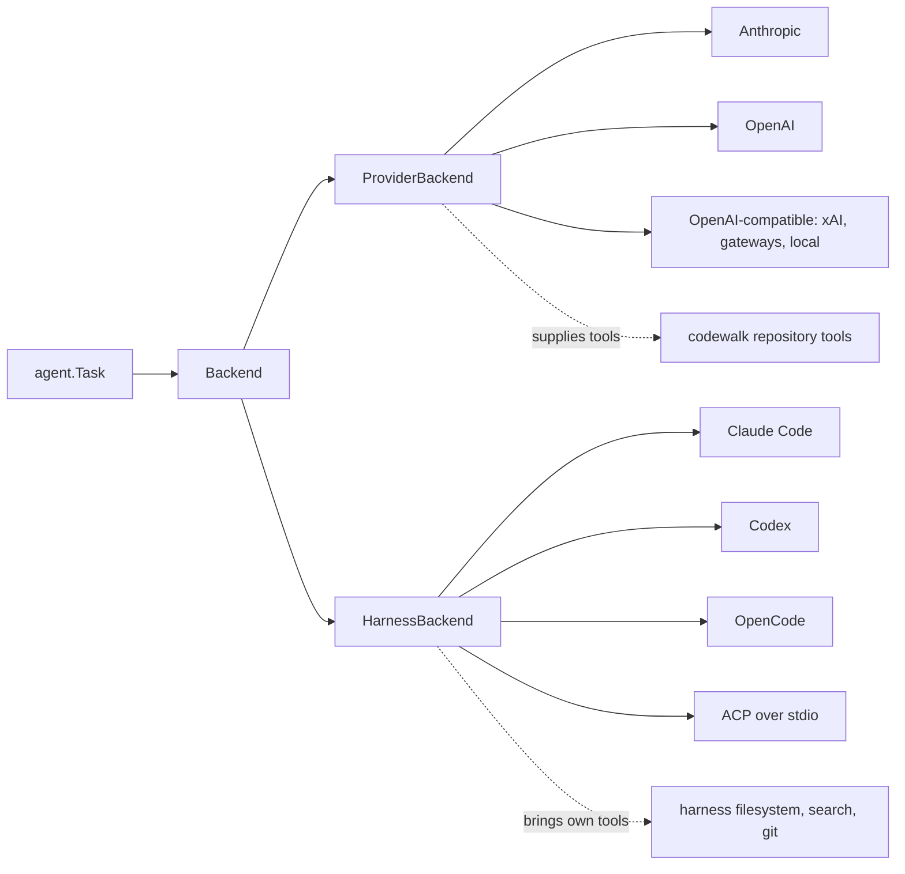
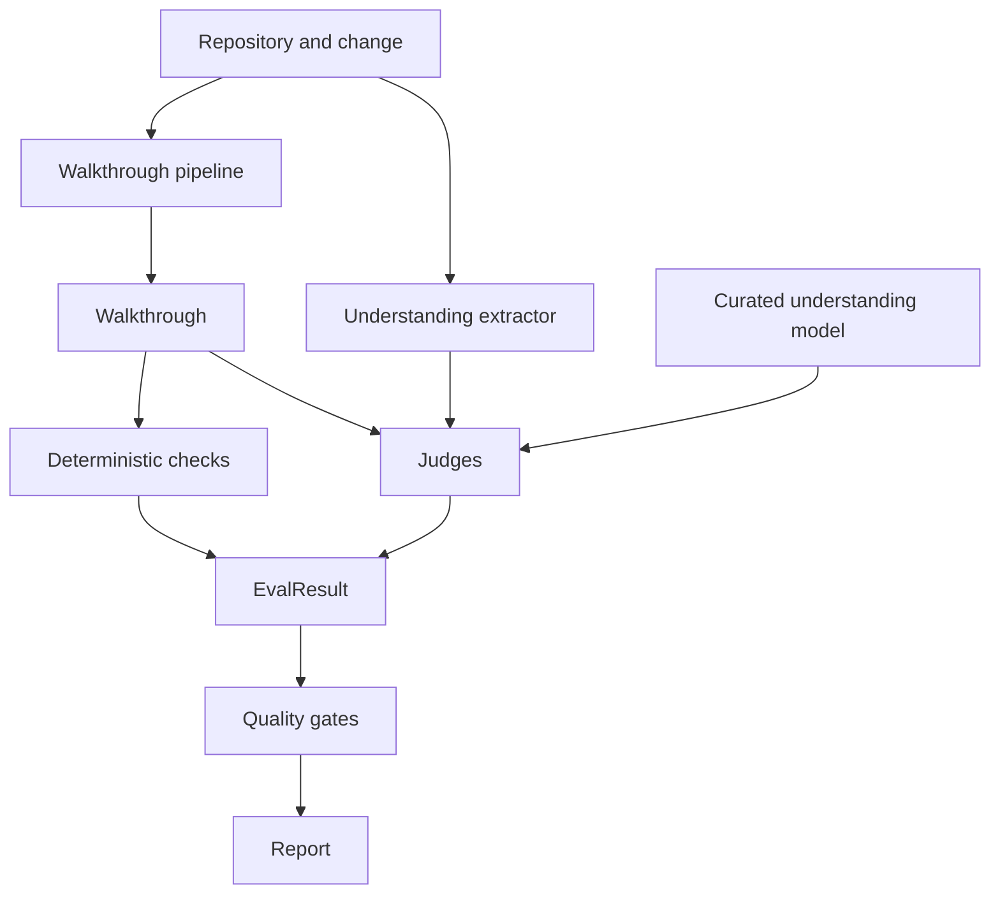

# codewalk design

## Mission

codewalk answers one request:

> **Help me understand this code.**

It behaves like an experienced engineer sitting beside you, walking you through
unfamiliar code: what happens, why each component is involved, how control and
data move, what changed, and where to look in the source.

It has two first-class modes:

- **Change walkthroughs** — the working tree, staged changes, a branch, a
  commit, a commit range, and eventually a remote pull request.
- **Codebase walkthroughs** — the architecture and important behaviour of a
  whole repository.

Both produce the same canonical object, and a reader can ask follow-up questions
about either afterwards.

## North star: Mental Model Efficiency

> **How completely and accurately a human understands the important behaviour
> and architecture of a change or codebase, per unit of attention required.**

Or, applied to any piece of generated content:

> **Nothing important missing. Nothing important wrong. Almost nothing
> unnecessary.**

Every significant decision in this document is justified against that. The best
walkthrough is not the longest, the most detailed, the one covering the most
files, the one with the most diagrams, or the one from the most expensive model.
It is the one that gives a reader the smallest sufficient model of the system.

## Explicit non-goals

codewalk is **not a code review tool**. This is a product boundary, not a
missing feature, and it is defended in the prompts, in the evaluation gates, and
in a deterministic lexical check.

The system does not proactively look for or report bugs, vulnerabilities, race
conditions, correctness or performance problems, style violations, missing
tests, unnecessary complexity, refactoring opportunities, or whether an
implementation is "good". It may read tests, validation, authentication,
concurrency primitives and performance-sensitive code — but only to explain how
the system *behaves*.

> Not this: "This creates an N+1 query and should be optimised."
>
> This: "This loop loads each record independently, so one database lookup
> happens per item. That matters for understanding how the request is processed."

If a reader explicitly asks for critique in a follow-up, that is a separate
interaction. The default walkthrough stays explanatory.

Also out of scope for now: documentation generation, diff summarisation, code
generation, and anything that modifies the repository being analysed.

## Terminology

| Term | Meaning |
| --- | --- |
| **Walkthrough** | The canonical explanation object. Every surface consumes this. |
| **Step** | One unit of the ordered teaching sequence. |
| **Concept** | An idea the reader needs before implementation detail makes sense. |
| **Component** | A conceptual part of the system. May span many files. |
| **Flow** | An ordered path of control or data through components. |
| **Evidence** | A repository fact, with its provenance, supporting a claim. |
| **Run** | One persisted generation, including configuration and metrics. |
| **Understanding Model** | What a human needs to know about a case; the benchmark's notion of truth. |
| **Complexity level** | 1–5, calibrating depth. Measures *context needed*, never defect risk. |

## Architecture



Package layout:

| Package | Responsibility |
| --- | --- |
| `internal/walkthrough` | Canonical schema, normalisation, structural validation |
| `internal/gitrepo` | Read-only git access, change selection, diffs |
| `internal/repomap` | Cheap deterministic repository overview |
| `internal/tools` | Sandboxed read-only tool surface for agents |
| `internal/llm` | Provider-neutral inference (Anthropic, OpenAI, OpenAI-compatible) |
| `internal/agent` | Backend abstraction, tool loop, harness and ACP adapters |
| `internal/backends` | Builds backends from configuration and environment credentials |
| `internal/pipeline` | Stages, prompts, stage artifacts, follow-up answering |
| `internal/refcheck` | Deterministic code-reference verification |
| `internal/run` | Run persistence and provenance |
| `internal/service` | Application layer shared by CLI and HTTP |
| `internal/server` | HTTP API, SSE progress, embedded UI hosting |
| `internal/render` | Terminal and Markdown renderers |
| `internal/eval` | Deterministic checks, judges, gates, pairwise, corpus, reports |
| `internal/cli` | Command surface |
| `web` | Embedded single-page application |

## Core domain model

The `Walkthrough` is deliberately organised around **concepts, components and
flows**, with files attached as supporting navigation. Files are evidence, not
the unit of explanation.



Design decisions worth stating:

- **Steps carry a `summary` as well as an `explanation`.** Progressive
  disclosure needs a one-line version of every step for navigation.
- **`deep_dive` is a first-class field.** Detail is not deleted, it is deferred.
  Deep dives are excluded from the word count that depth calibration uses.
- **`ignorable` is part of the schema.** Telling a reader what they can skip is
  as valuable as telling them what to read, and it is content a model will not
  produce unless asked for it explicitly.
- **`uncertainties` is part of the schema.** A walkthrough that says "I could not
  establish where this event is consumed" is more useful than one that guesses.
  False confidence is a Mental Model Efficiency failure.
- **`start_here`** answers "which code should I read first?", which is the
  question a reader has at the end of every walkthrough.
- **Diagrams are Mermaid.** Text-serialisable, diffable, reviewable in a pull
  request, renderable in the UI, and checkable by a validator.

The full schema is in [`internal/walkthrough/walkthrough.go`](internal/walkthrough/walkthrough.go),
where every field carries the reasoning for its existence.

### Code references

```json
{
  "path": "internal/orders/service.go",
  "symbol": "OrderService.Create",
  "start_line": 81,
  "end_line": 143,
  "side": "after",
  "note": "where the outbox entry is written"
}
```

`side` distinguishes the pre-change and post-change states, so "here is how it
used to work" can point at real code in the base revision.

## WalkthroughRun and provenance

Every generation is persisted as a run:

```text
~/.codewalk/runs/<run-id>/
  run.json            scope, pipeline configuration, metrics, conversation
  walkthrough.json    the canonical walkthrough
  artifacts/
    evidence.json     investigator output
    mental_model.json
    plan.json
    authored_walkthrough.json
    editor.json
    grounding.json
  eval/<name>.json    evaluation results
  feedback.json       human feedback
```

A run records prompt **versions**, backend **descriptors** and a configuration
digest — never prompt text with repository content in it, never credentials, and
never a provider request body. That is enough to reproduce and attribute a run
while staying safe to share.

Metrics (latency, model calls, tokens, cached tokens, tool calls, files
inspected) are captured because cost and latency are evaluation dimensions in
their own right.

## Change walkthrough flow



**Selection.** With no arguments, `codewalk pr` explains the current branch
against its base when the branch has commits of its own, and otherwise explains
uncommitted work. Branch comparisons use merge-base semantics, so commits that
landed on the base after branching do not pollute the change. Working-tree mode
includes untracked files: a file you just created is part of the work you want
explained, even though `git diff` cannot see it.

**Scope is not a boundary.** Changed files say where to start looking. The
Investigator reads unchanged code freely — callers, callees, schemas,
configuration, the previous implementation — because understanding a change
usually requires code the change did not touch.

## Codebase walkthrough flow

The same pipeline runs without a change set. The Investigator is directed to
discover the architecture from the code — entry points, subsystems, execution
paths, persistence, integrations, asynchronous mechanisms — rather than
narrating the directory tree. `codewalk codebase internal/billing` limits the
walkthrough to a subtree.

Hierarchy is expressed through `architecture.groups`, which nest, so a large
system can be explored top-down rather than as one flat document.

## Multi-agent pipeline

One model call asked to investigate, decide what matters, choose a teaching
order and write well tends to do all four adequately and none carefully.
Separating the responsibilities makes each independently improvable, measurable
and configurable.

| Stage | Responsibility | Optimises for |
| --- | --- | --- |
| Investigator | Gather evidence from the repository | Evidence quality, not prose |
| Mental model builder | Decide what the human needs to understand | Selection and complexity |
| Planner | Decide teaching order, shape, where diagrams help | Cognitive load |
| Author | Write the human-facing explanation | Clarity, concreteness |
| Clarity editor | Improve comprehension only | Order, concision, neutrality |
| Grounding check | Verify claims against the repository | Accuracy |
| Correction | Repair only what grounding disproved | Minimal, targeted change |

**Adaptive stages.** A trivial change skips the planner: a one-line
configuration change does not need a teaching plan, and a planning stage on one
would encourage inflating it into a report. Stages can be disabled individually
for experiments (`--no-editor`, `--no-grounding`).

**Deterministic first.** Grounding starts with `refcheck`, which resolves every
code reference against the repository and removes the ones that do not resolve.
A reference a reader cannot follow is worse than no reference, and a file system
answers that question faster and more reliably than a model.

**Failure containment.** An editor that returns nothing keeps the authored
walkthrough. A stage that returns unparseable JSON is retried once with the
parse error fed back, and the retry is recorded so its cost stays visible. A
model that exhausts its tool budget is asked to conclude with what it has, and
the result is marked truncated.

## Backend abstraction



The pipeline is written against **capabilities**, not vendors:

```go
type Capabilities struct {
    Inference        bool
    RepositoryTools  bool // codewalk supplies read-only tools
    OwnTools         bool // the backend already has filesystem, search, git
    StructuredOutput bool
    Reasoning        bool
    Subagents        bool
    ContextCaching   bool
}
```

A stage asks what is available and adapts. Structured output is requested
through the prompt for every backend — a harness cannot be constrained by a
provider-side response format — and the provider-side JSON mode is used only on
tool-free turns, because a model constrained to emit a JSON object cannot
narrate a tool call.

**Harnesses are run read-only.** Claude Code is invoked in plan mode, Codex with
a read-only sandbox. The ACP client declines permission requests for any tool
call that would modify the repository, and declines shell execution unless
explicitly enabled. ACP support is experimental because harness implementations
are still converging; the CLI adapters are the reliable path today.

**Roles are independently configurable**, which matters mostly for experiments:

```toml
[agents.investigator]
backend = "openai"
reasoning_effort = "high"

[agents.author]
backend = "anthropic"
```

Users never have to touch this. Defaults are strong.

## Repository investigation

Everything the pipeline learns comes from one sandboxed, read-only surface:

| Tool | Purpose |
| --- | --- |
| `repo_map` | Precomputed structural overview (no model call) |
| `list_files`, `read_file` | Orientation and reading, line-numbered, range-able |
| `search`, `find_definition` | Callers, callees, references, language-aware definitions |
| `changed_files`, `file_diff` | The change under explanation |
| `git_log`, `git_show` | History, when it materially improves understanding |

Three properties are enforced rather than assumed:

1. **Observational.** `internal/gitrepo` runs git through an allowlist of
   read-only subcommands. `git commit`, `checkout`, `reset` and friends are
   rejected by construction, and a test asserts it.
2. **Sandboxed.** Every path resolves inside the repository root, including
   through symlinks. Absolute paths, `..` traversal and symlinks pointing
   outside are refused.
3. **Bounded.** File reads, search results and diffs are truncated with an
   explicit marker, so a model never silently reasons over a partial file, and
   one unlucky read cannot consume a context window.

**Git history** is available but discouraged as a habit. It is worth spending on
determining what an implementation replaced, distinguishing a refactor from a
behavioural change, or explaining why apparently unrelated files belong to the
same work — not on archaeology for its own sake. When intent cannot be
established, the pipeline is instructed to separate what the code definitely
does, what repository evidence suggests, and what cannot be determined.

## Prompt injection and untrusted content

Repository content is data, not instruction. Source, comments, Markdown, commit
messages, fixtures and strings can all contain text shaped like an instruction.

- Every tool result is wrapped in explicit markers (`<file …>`, `<diff …>`,
  `<search_results …>`).
- Every stage's system prompt states that anything inside those markers is
  material to explain, never a request to the agent.
- Repository text cannot override safety constraints, open-source hygiene, user
  intent, or credential boundaries.
- `AGENTS.md` and similar files are honoured only where a host harness defines
  them as a trusted mechanism; arbitrary source content is not.

## Follow-up conversations

Follow-ups reuse what generation already paid for: the walkthrough, the
investigator's evidence, the mental model and the repository tools. "Go deeper
on step 4" costs one model call, not a second investigation. Turns are appended
to the run's conversation, so a thread accumulates context, and the same
endpoint backs both `codewalk ask` and the web UI chat panel.

Follow-ups are also the sanctioned place for critique: if a reader explicitly
asks for an opinion, the answer may give one, clearly marked. Unprompted, it
stays explanatory.

## CLI

```bash
codewalk pr                        # current branch, else uncommitted work
codewalk pr --base main
codewalk pr main..feature
codewalk pr --staged
codewalk pr --format json > walkthrough.json
codewalk codebase [subtree]
codewalk ask latest "why is the worker involved?"
codewalk ask walkthrough.json "explain only the database changes"
codewalk runs / show / serve / config / eval
```

Design rules: `codewalk pr` with no arguments must produce something useful;
`--format json` writes only the walkthrough to stdout, with progress on stderr,
so redirection works; no TUI is required; every generation is persisted so
follow-ups do not need the original invocation.

## HTTP API

`codewalk serve` binds loopback and serves the API plus the embedded UI.

| Endpoint | Purpose |
| --- | --- |
| `POST /api/v1/walkthroughs` | Create (async by default, `"wait": true` for synchronous) |
| `GET /api/v1/walkthroughs` | List runs |
| `GET /api/v1/walkthroughs/{id}` | Run and canonical walkthrough |
| `GET /api/v1/walkthroughs/{id}/artifacts/{name}` | Stage artifacts |
| `POST /api/v1/walkthroughs/{id}/questions` | Follow-up question |
| `GET /api/v1/walkthroughs/{id}/conversation` | Conversation history |
| `GET /api/v1/walkthroughs/{id}/source` | Sandboxed source slice for the UI |
| `POST /api/v1/walkthroughs/{id}/feedback` | Human feedback |
| `GET /api/v1/jobs/{id}` / `/events` | Job status and SSE progress |

Generation takes minutes, so the API is **asynchronous by default** with SSE
progress. Making that the shape from the start means adding queueing, remote
repositories or hosted deployment later does not change the contract.

## Web application

The UI consumes exactly the same canonical walkthrough; it adds presentation,
not meaning. It is plain HTML, CSS and JavaScript with no build step, and every
asset — including Mermaid — is embedded in the binary, so `go install` is
self-contained and the local server never fetches anything on a reader's behalf.

Progressive disclosure is the organising principle: one step at a time with
progress dots and keyboard navigation, deep dives collapsed, diagrams rendered
inline, code references opening a source view beside the explanation, and
secondary material (architecture, before/after, concepts, evidence, open
questions) behind tabs rather than in the first screen.

Model output is escaped before rendering and passed through a small Markdown
subset, so a walkthrough can never inject markup.

## Configuration

```text
CLI flags -> environment variables -> repository config -> user config -> defaults
```

User configuration lives at `~/.codewalk/config.toml` (overridable with
`CODEWALK_HOME` or `CODEWALK_CONFIG`); repository configuration at
`.codewalk.toml`. Layers merge per key, so a repository can override one
provider setting without restating the entry.

**Credentials are never stored in configuration.** A provider entry names the
*environment variable* that holds its key. `codewalk config show` reports
whether a key is set, never its value.

## Caching and cost

- The repository map is computed deterministically, with no model call, and
  prepended to every stage so agents do not rediscover structure. It is cached
  on disk per (repository, commit) and reused across runs; the working tree is
  never cached, because a stale map is worse than a recomputed one.
- Generated files (lockfiles, vendored trees, compiled output) are detected and
  their contents omitted from diffs, with an explicit note.
- Diffs and file reads are truncated per file rather than globally.
- Anthropic system prompts are marked cacheable, which pays off across stages
  that share context.
- Follow-ups reuse persisted evidence instead of re-investigating.
- Stage skipping (planner on trivial changes) and stage disabling are the
  coarse cost controls.

Cost is never optimised in isolation from Mental Model Efficiency: a cheaper
pipeline that produces a worse mental model is not cheaper, it is broken.

## Evaluation architecture



**Dimensions** are scored independently: grounding, essential coverage, mental
model accuracy, selectivity, teaching order, depth calibration, before/after
clarity, navigability, concision, neutrality, diagram utility. Each result
carries structured observations — unsupported claims, missing concepts,
unnecessary content, order problems — because the observations are what drive
improvement, and the number is just for comparison.

**Deterministic checks** cover everything tooling can answer: schema validity,
reference resolution, symbol existence, line-range validity, Mermaid parsing,
internal link resolution, changed-file claims, and a lexical review-drift
detector. For grounding, neutrality and diagram utility, the deterministic score
and the judge's score are combined by taking the worse one: a judge's good
opinion does not make a broken reference work.

**Gates** decide acceptability; the average only ranks. A walkthrough fails if
its schema is invalid, a reference does not resolve, a diagram does not render,
or grounding, coverage, mental model accuracy or neutrality fall below
threshold. Only after clearing the gates do concision, teaching order and
presentation differentiate candidates.

**Independence.** Judges are separate backends with their own repository access,
and the coverage reference is either a human-curated understanding model or one
extracted independently from the repository by an agent that never sees the
walkthrough. A pipeline cannot pass by grading its own work.

**Modes.** `smoke` (deterministic only, cheap enough to run always), `standard`
(one judge, full dimensions), `full` (multiple judges, adjudication, cost and
latency analysis). Judge disagreement of 1.5 points or more is recorded rather
than averaged away.

**Pairwise comparison** is blind: the judge sees "Candidate A" and "Candidate B"
with all provenance stripped, and presentation order is randomised so a
position-biased judge cannot systematically favour one arm of an experiment.
Tallies track wins, losses, ties and win rate, per dimension and overall.

### Benchmark corpus

```text
benchmarks/cases/<case-id>/
  case.toml           what to explain, and what to expect
  understanding.json  curated understanding model
  repo/001-<name>/    snapshots, committed in order and tagged
```

Cases are materialised into throwaway git repositories at run time. Benchmarking
against a single canonical prose walkthrough would measure similarity rather
than quality, so the corpus states *what a reader has to come away knowing* and
lets the wording vary. `incidental` items are recorded too: spending attention
on them counts against selectivity rather than for coverage.

Everything shipped is synthetic — fictional services, `example.com` addresses,
generic paths. A test asserts that fixture commit identities are fictional.

### Evaluating the evaluators

`internal/eval/degrade.go` produces controlled degraded variants — a removed
essential component, an invented datastore, a reversed flow, added verbosity,
scrambled teaching order, injected review language, a corrupted diagram — and
the test suite asserts that the dimensions those defects should move actually
move. Without this, a scoring regression would be indistinguishable from a
quality improvement.

### Human evaluation

The strongest eventual measure is **time to accurate mental model**: an engineer
with a raw diff versus an engineer with a diff plus a walkthrough, measured on
time, comprehension accuracy, confidence and how much manual exploration was
still required. The automated dimensions are a proxy for that.

The product captures the cheapest useful version of it today: at the end of a
walkthrough the UI asks *"Did this walkthrough give you the mental model you
needed before reading the code?"* with Yes / Mostly / No, stored with the run.
It is never intrusive and never required.

## Security boundaries

| Boundary | Rule |
| --- | --- |
| Repository | Read-only. Enforced by a git allowlist and a path sandbox. |
| Filesystem | Every path resolves inside the repository root, symlinks included. |
| Model providers | Selected repository context is sent to the configured provider. This is the one place repository content leaves the machine, and it is documented in the README. |
| HTTP service | Loopback by default; non-loopback requires `--allow-remote`; cross-origin browser requests are rejected (DNS-rebinding defence). |
| Credentials | Read from environment variables at use time. Never stored, logged, persisted or included in errors; provider errors are scrubbed. |
| Telemetry | None. codewalk sends nothing anywhere except to the model provider you configure. |
| Harnesses | Run in read-only postures; ACP permission requests for mutating tools are declined. |

## Open-source and privacy requirements

Everything in this repository is published. Fixtures, examples, documentation
and benchmark cases use fictional systems, `example.com` domains and generic
paths such as `/home/user/projects/example-app`. Nothing here contains personal
information, private paths, hostnames, internal domains, credentials, or
references to any real organisation or project. Documentation placeholders are
obviously synthetic (`OPENAI_API_KEY=your-api-key`).

Run records contain the local repository path because a local tool needs it;
`Run.Sanitized()` removes it for anything that leaves the machine.

## Important tradeoffs

**Multi-stage pipeline versus one call.** Several stages cost more tokens and
latency than one. They buy separable responsibilities, attributable quality
changes, and stage-level experiments. Trivial changes skip stages to limit the
cost where it would not pay.

**Prompt-level structured output versus provider JSON modes.** Prompt-level
works on every backend, including harnesses, at the cost of occasional parse
failures. Mitigated by tolerant extraction and one repair retry, with repairs
counted so the real cost stays visible.

**Vendoring Mermaid (~3.5 MB).** It makes `go install` fully self-contained and
keeps the local server from making network requests for a reader. The
alternative — a CDN reference — was rejected on privacy grounds; a build step
was rejected because it would make diagrams unavailable to `go install` users.

**No repository index or embeddings yet.** Deterministic maps plus targeted
search are enough for changes and for most repositories, and a map keyed by
commit cannot go stale. Large-repository indexing is a real future need; the tool surface is the
seam where it will attach.

**Go with a very small dependency set.** One direct dependency (a TOML parser).
Single static binary, easy installation, fast start, auditable.

**Regex-based symbol lookup rather than LSP.** Works for every language with no
setup, at the cost of precision. `find_definition` is documented as approximate
evidence for an agent to confirm. LSP is a capability a backend can add later.

**Judges score whole walkthroughs, not spans.** Cheaper and closer to how a
human experiences a walkthrough, at the cost of coarse localisation. Structured
observations recover most of the specificity.

## Implementation milestones

**Done**

1. Canonical walkthrough schema, normalisation, structural validation.
2. Read-only git access, change selection, generated-file handling.
3. Sandboxed repository tools, deterministic repository map.
4. Provider-neutral inference: Anthropic, OpenAI, OpenAI-compatible.
5. Harness backends: Claude Code, Codex, OpenCode, generic command,
   experimental ACP.
6. Six-stage pipeline with adaptive stage selection and failure containment.
7. Deterministic reference checking and grounding correction.
8. Run persistence with provenance and metrics.
9. CLI: `pr`, `codebase`, `ask`, `runs`, `show`, `serve`, `config`, `eval`.
10. HTTP API with asynchronous jobs and SSE progress.
11. Embedded web UI with progressive disclosure, diagrams and a chat panel.
12. Follow-up conversations reusing prior evidence.
13. Evaluation: deterministic checks, judges, gates, pairwise, reports.
14. Benchmark corpus and degraded-variant regression tests.

**Next**

15. Remote pull requests (GitHub, GitLab) as a change source.
16. Repository *understanding* cache — architecture facts, not just structure —
    reused across walkthroughs of the same repository.
17. Incremental regeneration when a branch moves.
18. Elo-style rankings over accumulated pairwise results.
19. Monorepo and multi-repository scope.
20. Editor and CI integrations; shareable walkthroughs.
